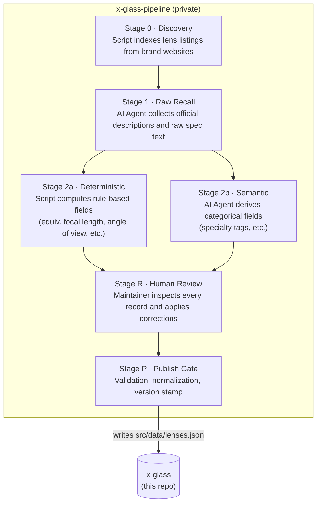

# X-Glass

Browse, filter, and compare every Fujifilm X-mount lens side by side — native Fujifilm and all major third-party brands.

**[xglass.sentacraft.com](https://xglass.sentacraft.com)**


---

## Features

- **121 lenses** across 8 brands: Fujifilm, Sigma, Tamron, Viltrox, TTArtisan, 7Artisans, Brightin Star, SG Image
- Multi-axis filtering: focal length, aperture, AF, OIS, weather resistance, specialty tags
- Side-by-side comparison of up to 6 lenses
- Shareable comparison posters
- PWA — installable on iOS and Android
- English + Chinese (中文)

## Tech Stack

| Layer | Choice |
|-------|--------|
| Framework | Next.js (App Router) + TypeScript |
| Styling | Tailwind CSS |
| Deployment | Vercel |
| Data | `src/data/lenses.json` (co-located with source) |
| i18n | next-intl |

## Data Pipeline

Lens data and images are maintained by the private [`x-glass-pipeline`](https://github.com/ericzeyuzhang/x-glass-pipeline) repo and written into `src/data/lenses.json` via a staged pipeline:



**Key principles:**
- Every spec originates from official manufacturer sources, with human review at every stage
- Deterministic fields (angle of view, equivalent focal length) are computed in code — never inferred by LLM
- Stage isolation: each step may only build on facts confirmed in the prior step

## Local Development

```bash
# Install dependencies
npm install

# Copy environment variables
cp .env.example .env.local
# Fill in GITHUB_TOKEN and GITHUB_FEEDBACK_REPO

# Start dev server
npm run dev
```

Open [http://localhost:3000](http://localhost:3000).

## Contributing

This project does not accept code contributions at this time.

To report a data issue (wrong spec, broken image) or suggest a missing lens, use the feedback links inside the app, or open a [GitHub Issue](https://github.com/ericzeyuzhang/x-glass/issues).

## Acknowledgments

Built with significant help from [Claude Code](https://claude.ai/code) (architecture and engineering) and [Google Gemini](https://gemini.google.com) (UX design).

## License

© 2026 Eric Zhang. All rights reserved.

Source code is made available for reference. No license is granted to use, copy, modify, or distribute this software.
