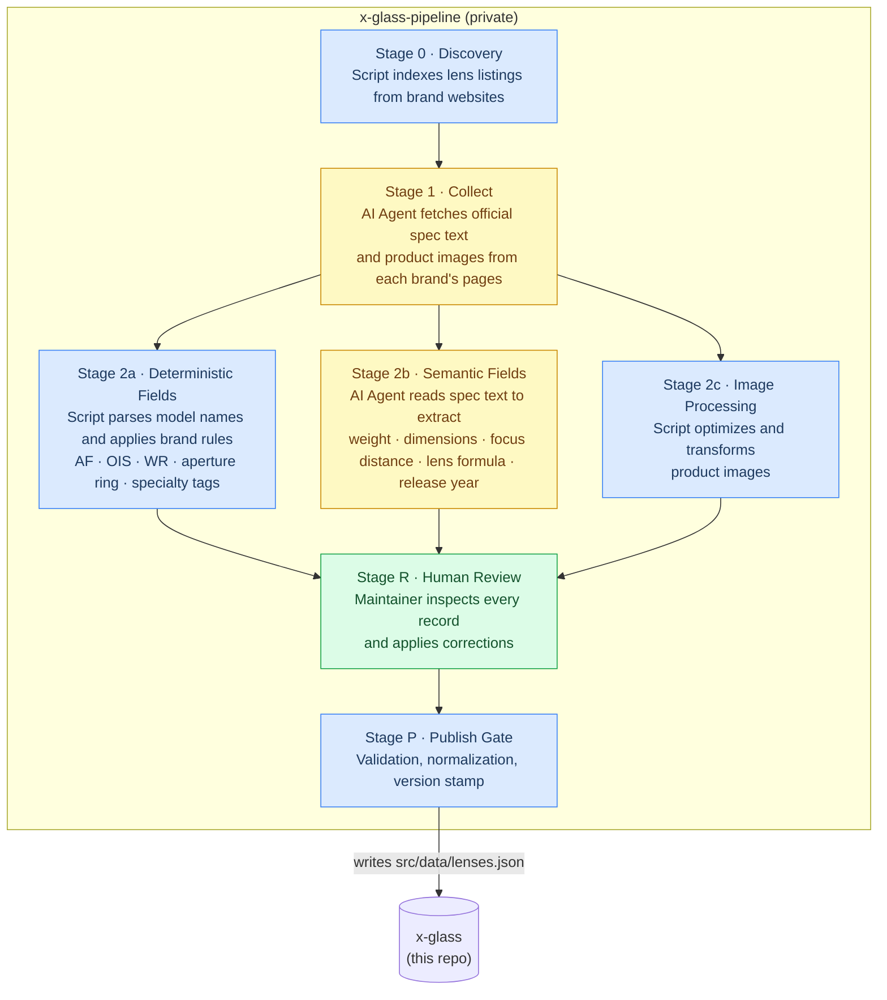

# X-Glass

Browse, filter, and compare every Fujifilm X-mount lens side by side — native Fujifilm and all major third-party brands.

**[xglass.sentacraft.com](https://xglass.sentacraft.com)**

**Desktop**


**Mobile**


---

## Features

- **Growing lens database** — 8 major brands covered in the first release (Fujifilm, Sigma, Tamron, Viltrox, TTArtisan, 7Artisans, Brightin Star, SG Image), with more brands on the roadmap
- **Clean, focused UI** — distraction-free interface designed around the comparison workflow
- **Filter and sort** — multi-axis filtering (focal length, aperture, AF, OIS, weather resistance, specialty tags) combined with flexible sorting
- **Side-by-side comparison** of up to 4 lenses
- **Normalized data** — specs from different manufacturers use inconsistent formats and terminology; X-Glass maps everything to a consistent schema so comparisons are fair and objective
- **Pipeline-backed accuracy** — every spec originates from official manufacturer sources and goes through a staged pipeline with human review at every step
- **Shareable comparison posters**
- **PWA** — installable on iOS and Android
- **English + Chinese** (中文)

## Tech Stack

| Layer | Choice |
|-------|--------|
| Framework | Next.js (App Router) + TypeScript |
| Styling | Tailwind CSS |
| Deployment | Vercel |
| i18n | next-intl |

## Data Pipeline

Lens data and images are maintained by the private [`x-glass-pipeline`](https://github.com/ericzeyuzhang/x-glass-pipeline) repo and written into `src/data/lenses.json` via a staged pipeline:



**Key principles:**
- Every spec originates from official manufacturer sources, with human review at every stage
- Deterministic fields are computed in code — never inferred by LLM
- Stage isolation: each step may only build on facts confirmed in the prior step

## Local Development

```bash
# Install dependencies
npm install

# Copy environment variables
cp .env.example .env.local
# Fill in GITHUB_TOKEN and GITHUB_FEEDBACK_REPO

# Start dev server
npm run dev
```

Open [http://localhost:3000](http://localhost:3000).

## Contributing

This project does not accept code contributions at this time.

To report a data issue (wrong spec, broken image) or suggest a missing lens, use the feedback links inside the app, or open a [GitHub Issue](https://github.com/ericzeyuzhang/x-glass/issues).

## Acknowledgments

Built with significant help from [Claude Code](https://claude.ai/code) (architecture and engineering) and [Google Gemini](https://gemini.google.com) (UX design).

Built on the shoulders of great open source work: [Base UI](https://base-ui.com), [Motion](https://motion.dev), [Lucide](https://lucide.dev), [next-intl](https://next-intl.dev), [modern-screenshot](https://github.com/qq15725/modern-screenshot), [qrcode.react](https://github.com/zpao/qrcode.react), [Geist](https://vercel.com/font).

## License

© 2026 SentaCraft. All rights reserved.

Source code is made available for reference. No license is granted to use, copy, modify, or distribute this software.
