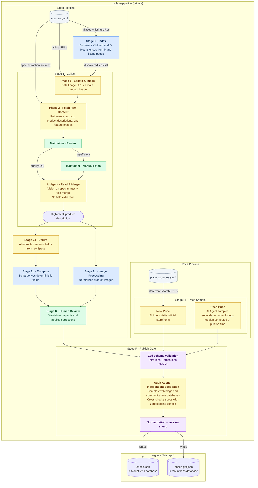

# X-Glass

Browse, filter, and compare Fujifilm X-mount lenses — native Fujifilm glass plus a growing set of third-party brands. G-mount (medium format) is also being added.

**English**：[xglass.sentacraft.com/en](https://xglass.sentacraft.com/en)

**简体中文**：[xglass.sentacraft.com/zh](https://xglass.sentacraft.com/zh)

**Desktop**


**Mobile**


---

## Features

- **Growing lens database** — focused on X-mount: full coverage of Fujifilm's first-party lineup plus a curated set of third-party brands (Sigma, Tamron, Viltrox, TTArtisan, 7Artisans, Brightin Star, SG Image), with more brands under evaluation. G-mount (medium format) coverage is also under way for Fujifilm's first-party GF lineup.
- **Clean, focused UI** — distraction-free interface designed around the comparison workflow
- **Filter and sort** — multi-axis filtering (focal length, aperture, AF, OIS, weather resistance, specialty tags) combined with flexible sorting
- **Side-by-side comparison** of up to 4 lenses
- **Normalized data** — specs from different manufacturers use inconsistent formats and terminology; X-Glass maps everything to a consistent schema so comparisons are fair and objective
- **Pipeline-backed accuracy** — every spec originates from official manufacturer sources and goes through a staged pipeline with human review at every step
- **Shareable comparison posters**
- **Progressive Web App (PWA)** — X-Glass is a web app at its core, but installs and runs like a native app. Add it to your home screen (iOS / Android) or dock (macOS) for instant, full-screen access — no App Store required
- **Deep localization** — English and Chinese (中文) editions go beyond UI translation: pricing sources, used-market listings, and manufacturer links are all tailored to each audience's local market

## Install

X-Glass is a web app — open it in any browser and start using it right away.

It also supports installation as a **Progressive Web App (PWA)**: add it to your home screen (iOS / Android) or dock (macOS) for full-screen access, offline support, and a more native feel — no App Store required.

**[Get the app →](https://xglass.sentacraft.com/en/get)**

## Tech Stack

| Layer | Choice |
|-------|--------|
| Framework | Next.js (App Router) + TypeScript |
| Styling | Tailwind CSS |
| Deployment | Cloudflare Workers (OpenNext) |
| i18n | next-intl |
| Data Validation | Zod |
| Testing | Vitest + Playwright |

## Data Pipeline

For a lens comparison tool, data accuracy isn't a nice-to-have — it's the product. X-Glass normalizes specs from manufacturer sources, treats price data as point-in-time reference snapshots rather than real-time quotes, and is backed by a purpose-built, multi-stage data pipeline:

Lens data and images are maintained in a private pipeline repo and written into `src/data/lenses.json` (X mount) and `src/data/lenses-gfx.json` (G mount).



**Key principles:**
- Every spec originates from official manufacturer sources, with human review at every stage
- Deterministic fields are computed in code — never inferred by LLM
- Stage isolation: each step may only build on facts confirmed in the prior step

## Local Development

```bash
# Install dependencies
npm install

# Copy environment variables
cp .env.example .env.local
# Fill in GITHUB_TOKEN and GITHUB_FEEDBACK_REPO

# Start dev server
npm run dev
```

Open [http://localhost:3000](http://localhost:3000).

## Contributing

Small fixes are welcome. For larger code changes or new features, please open an issue first so we can align on scope before implementation.

To report a data issue (wrong spec, broken image) or suggest a missing lens, use the feedback links inside the app, or open a [GitHub Issue](https://github.com/sentacraft/x-glass/issues).

If you find X-Glass useful, a ⭐ on this repo goes a long way — and if you'd like to support the project: [donate](https://xglass.sentacraft.com/en/about#donation) · [打赏](https://xglass.sentacraft.com/zh/about#donation)

## Forking for Other Mounts

X-Glass covers both the Fujifilm X mount (APS-C) and the Fujifilm G mount (GFX medium format). Beyond Fujifilm, there are no plans to cover other systems — so if you'd like to build something similar for Sony E, Nikon Z, Canon RF, L-mount, or any other system, I'd genuinely love to see it happen. The code is MIT-licensed and you're very welcome to fork it; no permission needed. The notes below are meant to save you time, not to gatekeep.

**What's in the box, and what isn't.**
- ✅ **Source code** is MIT-licensed. Fork, modify, deploy, ship commercially — all fine. Just keep the `LICENSE` file and copyright notice intact.
- ✅ **Schema and field design** (`src/lib/types.ts`, Zod schemas, UI taxonomy) are part of the MIT code and free to reuse.
- ❌ **Lens data** (`src/data/lenses.json` and `src/data/lenses-gfx.json`) is under a separate proprietary license and isn't transferable — please don't copy it or use it as seed data, even for a different mount. See [`LICENSE-DATA`](LICENSE-DATA).
- ❌ **The data pipeline** (`x-glass-pipeline`) is a separate private repository and isn't part of this fork. You'll need to build your own collection and review workflow.

**Why the pipeline isn't open source (yet).** I get asked this a lot, so to be upfront about it:

1. **It is not a reusable general extractor yet.** The prompts, review steps, and edge cases are tuned to the brands currently covered.
2. **The intermediate inputs are not meant to be redistributed.** The published data is curated, but the collection layer touches manufacturer text and images that should not be republished as raw material.
3. **The workflow is still evolving.** The diagram above shows the shape of the system without presenting it as a stable reference implementation.

If the pipeline matures and those concerns ease over time, I'm open to revisiting. Until then, building your own collection layer is genuinely the right call — your mount, your source sites, your edge cases.

**Expect some refactoring.** The codebase has Fujifilm-specific assumptions baked in: per-mount crop factor math (APS-C ×1.5 for X, medium format for GFX), mount flange distances, generation-versioning conventions, and a few mount-specific field shapes. Supporting a non-Fujifilm system means abstracting these, not just swapping constants. It's not a huge lift, but worth planning for.

**A few small asks around branding.**
- Please pick a distinct project name — something other than "X-Glass" or close variants like "E-Glass" / "Z-Glass". I'd like to keep that name scoped to the Fujifilm project, and a fresh name will also help your project build its own identity.
- A short note in your README saying your project is an independent fork, not affiliated with or endorsed by X-Glass or SentaCraft, would be appreciated.
- Mount names (X, E, Z, RF, L) and manufacturer names are trademarks of their respective owners. Nominative use like "a tool for Sony E-mount lenses" is totally fine; just avoid using brand logos as your own project logo.

**Staying in sync is optional.** I'm not committing to ongoing coordination, but if you make improvements that aren't mount-specific — better schema abstractions, shared UI primitives, accessibility fixes, performance wins — PRs back upstream are very welcome. A quick issue first to align on scope helps both of us avoid wasted effort.

Questions about licensing, collaboration, or anything else: [xglass@sentacraft.com](mailto:xglass@sentacraft.com). Good luck — really hope to see your project out in the wild.

## Acknowledgments

Built with significant help from [Claude Code](https://claude.ai/code) (architecture and engineering) and [Google Gemini](https://gemini.google.com) (UX design).

Built on the shoulders of great open source work: [Base UI](https://base-ui.com), [Motion](https://motion.dev), [Lucide](https://lucide.dev), [next-intl](https://next-intl.dev), [Zod](https://zod.dev), [Tailwind CSS](https://tailwindcss.com), [modern-screenshot](https://github.com/qq15725/modern-screenshot), [qrcode.react](https://github.com/zpao/qrcode.react), [Geist](https://vercel.com/font).

## License

**Source code** — [MIT](LICENSE) © 2026 SentaCraft

**Lens data** (`src/data/lenses.json`, `src/data/lenses-gfx.json`) — [Proprietary](LICENSE-DATA) © 2026 SentaCraft
Available for personal reference only. Redistribution, commercial use, and bulk scraping are not permitted.

**Product images and brand trademarks** are the property of their respective owners.
X-Glass is an independent third-party tool, not affiliated with or endorsed by any manufacturer.
Rights holders may contact [xglass@sentacraft.com](mailto:xglass@sentacraft.com) for takedown requests.
