# Data Pipeline — Detailed Reference

Full architecture of the `x-glass-pipeline` (private repo) that produces `src/data/lenses.json`.

```mermaid
flowchart TD
  subgraph pipeline["x-glass-pipeline (private)"]
    SOURCES[("sources.yaml\n· Brand aliases\n· Listing URLs per brand\n· Spec extraction sources per brand")]

    S0["Stage 0 · Index\nDiscovers X-mount lenses from brand listing pages\n· Normalizes brand names via aliases\n· Deduplicates via generated lens ID"]

    subgraph s1["Stage 1 · Collect"]
      S1p1["Phase 1 · Locate & Image  (batch per brand)\nNavigates listing pages → records official detail page URLs\nDownloads main product image from listing thumbnails"]
      S1p2["Phase 2 · Fetch rawSpecs  (per lens)\nFetches spec text from spec extraction sources\nTools: Jina Reader · Playwright · FireCrawl\nNo parsing — raw material only"]
      S1r["Maintainer · Review\nInspects fetched text and image quality"]
      S1h["Maintainer · Manual Fetch\nHand-collects raw text and images\nif Agent recall is insufficient"]
      S1b["AI Agent · Read & Merge\nApplies vision to read text embedded in spec images\nMerges with webpage text into one raw block\nNo field extraction — structured parsing in Stage 2"]
      S1out(["Merged high-recall product description"])
    end

    S2a["Stage 2a · Derive\nAI Agent reads rawSpecs to extract\nweight · dimensions · focus distance · lens formula · release year"]
    S2b["Stage 2b · Compute\nScript applies brand rules to derive\nAF · OIS · WR · aperture ring · specialty tags"]
    S2c["Stage 2c · Image Processing\nScript optimizes, crops, and normalizes\nproduct images for visual consistency"]
    SR["Stage R · Human Review\nMaintainer inspects every record\nand applies corrections"]

    subgraph sp["Stage P · Publish Gate"]
      SP1["Zod schema validation against x-glass schema\n· Intra-lens: field formats, focal range, aperture ordering, lens formula integrity\n· Cross-lens: duplicate IDs, URLs, brand-models, and spec tuples (with known-distinct allowlist)"]
      SP2["Normalization + version stamp"]
    end
  end

  SOURCES -->|"aliases + listing URLs"| S0
  SOURCES -->|"listing URLs"| S1p1
  SOURCES -->|"spec extraction sources"| S1p2
  S0 -->|"discovered lens list"| S1p1
  S1p1 --> S1p2
  S1p2 --> S1r
  S1r -->|"quality OK"| S1b
  S1r -->|"insufficient"| S1h
  S1h --> S1b
  S1b --> S1out
  S1out --> S2a & S2c
  S2a --> S2b
  S2b & S2c --> SR
  SR --> SP1
  SP1 --> SP2
  SP2 -->|"writes src/data/lenses.json"| DB[("x-glass\n(this repo)")]

  classDef script fill:#dbeafe,stroke:#3b82f6,color:#1e3a5f
  classDef agent fill:#fef9c3,stroke:#ca8a04,color:#713f12
  classDef human fill:#dcfce7,stroke:#16a34a,color:#14532d
  classDef gate fill:#f3e8ff,stroke:#9333ea,color:#3b0764
  classDef config fill:#f1f5f9,stroke:#64748b,color:#1e293b

  class S0,S2b,S2c script
  class S1p1,S1p2,S1b,S2a agent
  class S1r,S1h,SR human
  class SP1,SP2 gate
  class SOURCES config
```

## Stage notes

### sources.yaml

The single source of truth for all pipeline runs. Contains per-brand:
- **Brand aliases** — used by Stage 0 for name normalization and lens ID generation
- **Listing URLs (`official_pages`)** — used by Stage 0 (lens discovery) and Stage 1 Phase 1 (detail page URLs + main image download)
- **Spec extraction sources (`collect_sources`)** — used by Stage 1 Phase 2 only; may differ from official pages (e.g. a brand's Shopify store may have better spec text than their official site)

### Stage 1 · Collect

Two phases with a human review checkpoint between raw fetch and final merge:

- **Phase 1 (batch per brand):** navigates listing pages to record each lens's official detail page URL and downloads the main product image from the listing thumbnail. Run once per brand listing page.
- **Phase 2 (per lens):** fetches rawSpecs — all spec-relevant text from the configured extraction sources. No field parsing at this stage; raw material only.
- **Review:** maintainer inspects fetched quality. If sufficient, proceeds to Read & Merge. If not, maintainer manually collects raw content and re-enters at Read & Merge.
- **Read & Merge:** AI agent applies vision to extract text from spec images, merges with webpage text. Output is a single high-recall raw text block. No field extraction.

### Stage 2 · Derive → Compute → Image Processing

- **2a Derive** runs first: AI agent reads the raw text block and extracts semantic fields.
- **2b Compute** depends on Derive output: script applies deterministic brand rules to produce AF, OIS, WR, aperture ring, and specialty tag fields.
- **2c Image Processing** is independent of 2a/2b and runs in parallel: script normalizes product images for visual consistency.

### Stage P · Publish Gate

Runs `tsx scripts/validate-lenses.mts` which imports the Zod schema from the main x-glass repo. Validation covers:
- **Intra-lens:** field formats, focal length ordering, aperture ordering (maxAperture ≤ minAperture), lens formula integrity (groups ≤ elements), URL formats, officialLinks presence
- **Cross-lens:** duplicate IDs, duplicate official URLs, duplicate brand/model/generation combinations, duplicate spec tuples — with a known-distinct allowlist for confirmed edge cases
